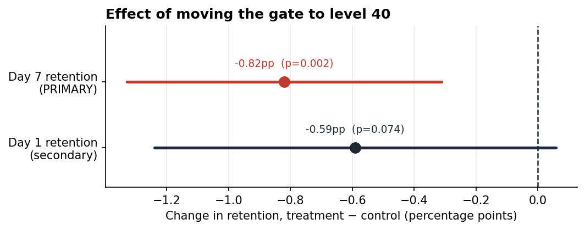

# Cookie Cats A/B test: a decision-quality analysis

[](https://www.python.org/)


A two-arm experiment on 90,189 mobile-game players, analysed from design through decision. The result is a clear recommendation: **do not ship** the level-30-to-level-40 progression-gate change.

> Moving the first gate reduced 7-day retention by **0.82 percentage points** (19.02% → 18.20%), 95% CI [−1.33, −0.31]pp, Holm-adjusted p = 0.0031. The sample-ratio mismatch is flagged and carried through the conclusion.

## Decision summary

| Metric | Control | Treatment | Effect | 95% CI | Adjusted p |
|---|---:|---:|---:|---:|---:|
| 7-day retention | 19.02% | 18.20% | **−0.82pp** | [−1.33, −0.31]pp | **0.0031** |
| 1-day retention | 44.82% | 44.23% | −0.59pp | [−1.24, +0.06]pp | 0.0744 |

The 7-day effect survives correction for the two horizons tested. Day 1 is inconclusive rather than evidence of safety. The practical implication is approximately 820 fewer retained players per 100,000 new installs, with the caveats below.

## Validity checks before interpretation

- **Sample-ratio mismatch:** 49.56% control / 50.44% treatment, χ² = 6.90, p = 0.0086.
- **Primary decision rule:** ship only if 7-day retention improves significantly and no guardrail degrades.
- **Post-treatment trap:** using rounds played as a covariate would break randomisation and can reverse the estimated effect.
- **Power limitation:** the available sample detects roughly a 3.8% relative 7-day change at 80% power, not every smaller effect.
- **Scope:** one cohort, one observation window and no revenue metric.



## Reproducible workflow

The design notebook loads assignment fields before outcomes, fixes the hypotheses and power analysis in advance, checks randomisation, calculates confidence intervals, runs bootstrap validation and applies Holm correction. A second notebook validates calibration and CUPED behaviour using simulated experiments with known effects.

```bash
git clone https://github.com/Yass149/ab-test-cookie-cats.git
cd ab-test-cookie-cats
python -m venv .venv
source .venv/bin/activate
pip install -r requirements.txt
pytest tests/ -v
jupyter nbconvert --execute --to notebook --inplace notebooks/*.ipynb
python scripts/check_consistency.py
```

Notebook 01 writes `results.json`; the consistency script checks that the README's headline figures still match the generated results.

## Repository layout

```text
notebooks/01_cookie_cats_ab_test.ipynb  design, analysis and recommendation
notebooks/02_cuped_simulation.ipynb     method validation against known truth
src/abtest.py                           statistical utilities
scripts/check_consistency.py            evidence/prose consistency check
tests/test_abtest.py                    automated checks
figures/                                committed diagnostic plots
data/                                  provenance and licence notes
```

## What this does—and does not—claim

This is a retrospective analysis, not a live experimentation platform. It does not establish causality beyond the dataset's randomisation and validity assumptions, resolve the unexplained SRM, measure revenue impact or generalise across cohorts and seasons. It demonstrates how to make a product decision while keeping uncertainty, power and data-quality failures visible.

## Interview takeaway

A good experiment can produce a “do not ship” decision. The value is not a positive result; it is preventing a harmful change from being presented as a win.
