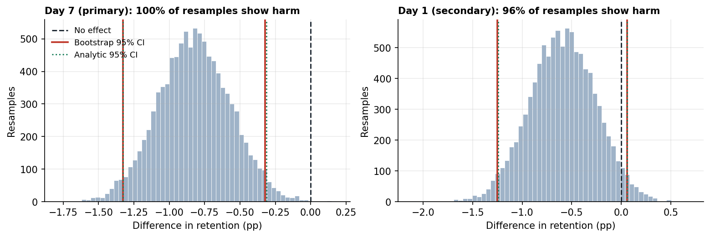
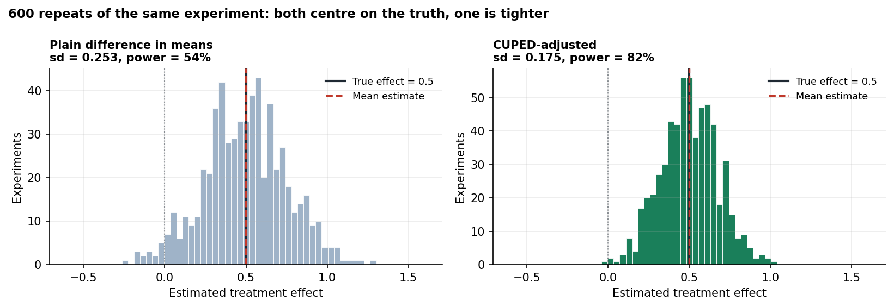
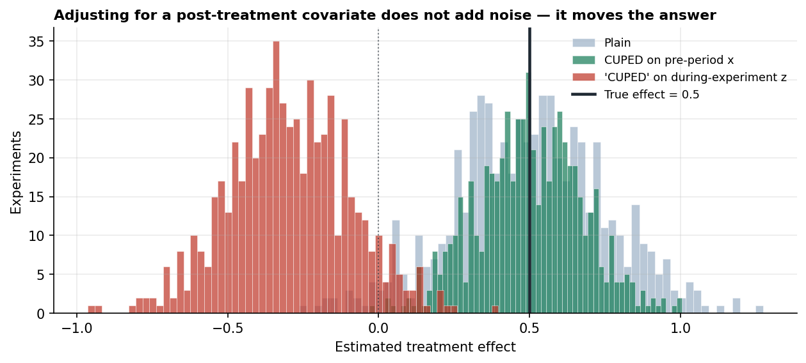

# A/B Test Design and Analysis — Cookie Cats

A two-arm experiment on 90,189 mobile game players, analysed as a readout rather than a tutorial:
the design is fixed before the outcomes are loaded, the randomisation is checked before the
results are trusted, and the recommendation is the one the evidence supports rather than the one
that would be nicer to report.

> ## Recommendation: do not ship
>
> Moving the first progression gate from level 30 to level 40 reduced **7-day retention by 0.82
> percentage points** — 19.02% → 18.20%, a **4.3% relative fall**, 95% CI [−1.33, −0.31]pp,
> p = 0.0016. The result survives correction for testing two horizons (Holm p = 0.0031). Every
> value inside the interval is a loss.
>
> Day-1 retention also fell (−0.59pp) but its interval crosses zero. That is **inconclusive**,
> not evidence of safety.
>
> **Caveat carried through every number:** the arms arrived 49.56 / 50.44 against an intended
> 50/50 — a sample ratio mismatch at p = 0.0086.

---

## What was tested

Cookie Cats is a match-three mobile game with progression gates: points where a player must wait,
pay, or invite friends before continuing. The first gate sat at **level 30**. The experiment moved
it to **level 40** for a randomly assigned half of new installs, on the theory that letting people
play longer before the first interruption would improve retention.

| | |
|---|---|
| Unit of randomisation | Player (one row each, no duplicates) |
| Control (`gate_30`) | 44,700 players |
| Treatment (`gate_40`) | 45,489 players |
| Primary metric | 7-day retention |
| Secondary metric | 1-day retention |
| Guardrails | Rounds played (mean, median); share of players with zero rounds |

## The design, fixed before the outcomes were loaded

This is the part most portfolio analyses skip, so it is made structural rather than stated:
**sections 1–4 of the notebook load only `userid` and `version`.** The outcome columns are not in
memory until section 5. An analysis that chooses its success criterion after seeing the results
can justify almost anything, and a design you cannot retro-fit is the only real defence.

**Hypothesis.** Moving the first gate from level 30 to level 40 does not change 7-day retention.
Rejected if a two-sided test clears α = 0.05 after correcting for the two horizons tested.

**Decision rule.** Ship only if 7-day retention improves significantly and no guardrail degrades.
A null result is not a reason to ship — the change has costs, so the default is to keep what we
have.

**Power, computed before any result was visible:**

| Metric | Assumed baseline | n per arm | Smallest detectable drop (80% power, α = 0.05) |
|---|---|---|---|
| 1-day retention | 45% | 44,700 | 0.93pp — **2.1% relative** |
| 7-day retention | 19% | 44,700 | 0.73pp — **3.8% relative** |

**This experiment is underpowered for its own primary metric, and that was recorded in advance.**
Detecting a 1% relative fall in 7-day retention would need roughly **670,000 players per arm**,
fifteen times what was available. So a null on day 7 would never have meant "no effect" — only
"no effect larger than about 4%".

## Validity checks, before the results

**Sample ratio mismatch: χ² = 6.90, p = 0.0086 — flagged.**

An intended 50/50 split arrived as 49.56 / 50.44, an excess of 789 players in treatment. An
imbalance this large would occur by chance about once in 116 experiments.

The threshold matters and deserves a reason. The industry convention is α ≈ 0.001, not 0.05,
because SRM is checked on *every* experiment — at 0.05 a platform running a thousand tests a year
would raise fifty false alarms and teams would learn to ignore the alert. So this result **fails
at 0.05 and passes at 0.001**.

What I would do, in order: take it to whoever owns the assignment service; look for a mechanism
(differential drop-out before logging, a broken hash, uneven bot traffic); note that here the
*larger* arm is treatment, whereas differential drop-out usually shrinks the worse-performing arm;
then proceed with the caveat attached. But if the day-7 result had been a marginal *win*, I would
not ship on it. A caveat weighs differently depending on which way it cuts.

This matters more than its two lines of code suggest: an SRM can manufacture a retention
difference out of nothing. If the treatment build silently failed to log some slow-connecting
users, those users are missing from the data *and* would have been least likely to return — so
treatment looks artificially healthy. Checking the split first is how you avoid explaining a
logging bug as a behavioural insight.

## Results


| Metric | Control | Treatment | Absolute | 95% CI | Relative | p | Holm p |
|---|---|---|---|---|---|---|---|
| **7-day retention** (primary) | 19.02% | 18.20% | **−0.82pp** | [−1.33, −0.31]pp | **−4.31%** | 0.0016 | **0.0031** |
| 1-day retention (secondary) | 44.82% | 44.23% | −0.59pp | [−1.24, +0.06]pp | −1.32% | 0.0744 | 0.0744 |

Intervals are reported before p-values throughout, because the interval carries the effect size
and the uncertainty together and answers the question a decision-maker actually has.

**Bootstrap check.** 10,000 resamples per metric, no normal approximation. The resampled interval
for day 7 is [−1.33, −0.32]pp against the analytic [−1.33, −0.31]pp — agreement to a hundredth of
a percentage point, so the z-test's assumptions held. 99.9% of resampled day-7 experiments show
harm.



**Guardrails: nothing catastrophic broke, and nothing rescues the primary metric.**

Rounds played returns a Mann-Whitney **p = 0.0502** — sitting a thousandth above the threshold,
which is a good moment to remember that 0.05 is a convention and that "p = 0.0502" and
"p = 0.0498" describe the same evidence. So rather than call it a clean pass, look at the size:
the common-language effect size is **0.496** against 0.500 for no difference at all, the
winsorised arms differ by ~0.3 rounds on a base of 49 (p = 0.62), and the medians are 17 and 16.
Marginal in significance, negligible in size, and leaning the same way as the retention loss.

The zero-round share was indistinguishable (4.33% vs 4.52%, p = 0.17) — the canary for a broken
build, and it did not sing.

## Why not to ship

1. **The primary metric moved the wrong way and the result holds up** — 4.3% relative fall,
   interval excluding zero, surviving correction for the second horizon.
2. **Every value in the interval is a loss.** The most favourable end is still a 1.6% relative
   fall. There is no reading in which this change is neutral.
3. **The secondary metric offers no rescue.** Day 1 also fell; its interval is dominated by harm.
4. **The guardrails rule out the easy excuses.** Not a broken build, not a logging artefact.
5. **The default is to keep what we have.** Shipping has a cost; the change has not earned it.

Per 100,000 new installs, shipping `gate_40` means roughly **820 fewer players still active at
day 7** — between 312 and 1,328 across the interval.

**Saying "do not ship" is the point.** The reflex is to hunt for a win because a win feels like a
result, but an experiment that correctly stops a harmful change has delivered exactly the value
it was built for.

**What would change my mind:** a pre-registered hypothesis that the gate move trades early
retention for monetisation, tested on revenue data not present here. That is a different
experiment with a different primary metric, and it would need to be run rather than argued.

## What this analysis cannot conclude

The section that decides whether the rest is trustworthy.

- **There is no pre-experiment data at all.** These are new installs, so there is no "before".
  That rules out CUPED and any covariate adjustment, and it is why the day-1 interval is wider
  than it needed to be. Whether variance reduction is available is decided when logging is
  specified, not when the analysis is written.
- **The SRM is unexplained.** Without access to the assignment service I can flag it, not resolve
  it. Every number here inherits that uncertainty.
- **The estimate is diluted.** The median player logged 16 rounds and never approached level 30,
  so most of the sample could not have been affected by the treatment. The true effect *among
  players who reach the gate* is larger than the intention-to-treat estimate reported here. The
  tempting fix — filtering to `sum_gamerounds >= 30` — is post-treatment conditioning and breaks
  randomisation, so it is demonstrated as a trap rather than used as a result.
- **One cohort, one window.** No novelty-effect check, no seasonality, no way to distinguish a
  transient reaction from a durable one.
- **No revenue metric.** Retention is a proxy. A change that hurt retention while raising revenue
  per player would look identical here.
- **Day 1 is not "no effect".** It is "no effect larger than about 2.1% relative, and quite
  possibly a 1.24pp fall".

## Does the method actually work?

A real experiment has no answer key, so "the treatment hurt retention" and "my analysis is
correct" cannot be separated on the Cookie Cats data alone. [Notebook
02](notebooks/02_cuped_simulation.ipynb) separates them by simulating experiments with a **known**
true effect.

| Question | Answer |
|---|---|
| Is the test calibrated? | Yes — 5.7% false positives under a true null, nominal 5% |
| Does it recover a known effect? | Yes — unbiased, 94% interval coverage |
| Would CUPED have helped? | Substantially: ~52% less variance, ~29% narrower intervals, **power 54% → 82%** |
| Can CUPED be applied to Cookie Cats? | **No** — no pre-assignment covariate exists |
| What if `sum_gamerounds` were used anyway? | The estimate **flips sign**, while looking *more* precise |



That last row is the one worth pausing on. Using a covariate measured *during* the experiment —
the shortcut most write-ups of this dataset take — produces an estimate of **−0.30 when the truth
is +0.5**, with a tighter interval than the unadjusted estimator and 95% confidence intervals
that contain the truth **2.3% of the time**. Every surface signal says the analysis improved.



The safeguard is chronological, not statistical: *was this variable already determined at the
moment of assignment?* If assignment could have changed it, it cannot go on the right-hand side.

## Repository

```
notebooks/01_cookie_cats_ab_test.ipynb   The experiment: design, validity, results, recommendation
notebooks/02_cuped_simulation.ipynb      Method validation against a known truth, and CUPED
src/abtest.py                            SRM, power/MDE, two-proportion test, bootstrap, CUPED
tests/test_abtest.py                     24 tests: agreement with statsmodels/scipy, calibration,
                                         coverage, unbiasedness
data/raw/cookie_cats.csv                 90,189 players (see data/README.md for provenance)
scripts/check_consistency.py             Asserts this README matches results.json
```

### Reproduce

```bash
pip install -r requirements.txt
pytest tests/ -v
jupyter nbconvert --execute --to notebook --inplace notebooks/*.ipynb
python scripts/check_consistency.py
```

Notebook 01 writes `results.json`; `check_consistency.py` asserts every headline number in this
README still matches it, so the prose cannot silently drift from the analysis.

## Interview notes

The five questions this project exists to answer.

**Why fix the sample size before you start?**
Because every time you check a running experiment you get another chance to cross the
significance line, and random walks cross lines. I simulated 1,000 experiments with **no** effect
and checked each ten times, stopping at the first significant result: the false positive rate went
from 4.9% to **19.4%**, a 4× inflation, on data where nothing was ever happening. Fixing the
sample size converts "look until it works" into a single pre-committed test with the error rate it
advertises. If you genuinely need to monitor for harm — and often you do — the honest way is
sequential testing with alpha spending, not peeking at a fixed-horizon test.

**What is a sample ratio mismatch and why check it first?**
It is a chi-square test asking whether the arms arrived in the proportions you asked for. It comes
first because it is a check on the *data collection*, and if the randomisation is broken then
every downstream number is measuring the bug rather than the treatment. Here the split was
49.56/50.44 on 90,000 users — p = 0.0086, which fails at 0.05 and passes the α = 0.001 convention
the industry actually uses, because a check that runs on every experiment at 0.05 would cry wolf
fifty times a year. The reason it matters: if a treatment build silently failed to log
slow-connecting users, those users are both absent from the data and the least likely to have
returned, so the treatment arm looks healthy for a reason that has nothing to do with the
treatment.

**Statistical versus practical significance?**
They come apart in both directions. At ten million users you can resolve a 0.001pp change — real,
and worth nothing. Conversely this experiment's day-1 result is statistically inconclusive while
its interval reaches −1.24pp, which would be a serious loss. So the question is never "is p <
0.05" but "what does the whole interval imply for the business, and what decision does that
support?" Here even the most optimistic end of the day-7 interval is a 1.6% relative fall, which
is what makes the recommendation easy.

**Why is slicing the data until something is significant a problem?**
Because with enough slices you are guaranteed a winner whether or not anything happened — twenty
tests at α = 0.05 give a 64% chance of at least one false positive. I demonstrated it by attaching
a **randomly generated** segment label to every user and re-running the analysis within each
segment: 20 tests, 2 "significant" at p < 0.05, and every one a false positive by construction
(0 survived Bonferroni). The named failure modes are p-hacking, HARKing — presenting the surviving
slice as though it had been the plan — and the garden of forking paths, where you never explicitly
test twenty things but your analysis choices depend on the data. The defences: fix the primary
metric in advance, correct for the tests you run, label unplanned subgroups *exploratory*, and
replicate anything interesting on fresh data.

**What is a guardrail metric, and why fail an experiment that beat its primary metric?**
A guardrail is a metric that must not degrade *even if the primary metric wins* — it encodes the
costs you are not willing to pay for the win. If this change had lifted 7-day retention while
halving rounds played, it would have found a way to keep people installed while making the game
worse, and I would fail it on the guardrail. Guardrails are also how you catch the experiment that
"won" because it was broken: the zero-round share here is a canary for a build that crashes on
launch, and it stayed flat, which is what rules out the most comfortable explanation for the
day-7 loss.

## Data

Cookie Cats A/B test, 90,189 players. Kaggle: `yufengsui/mobile-games-ab-testing`. See
[`data/README.md`](data/README.md).
